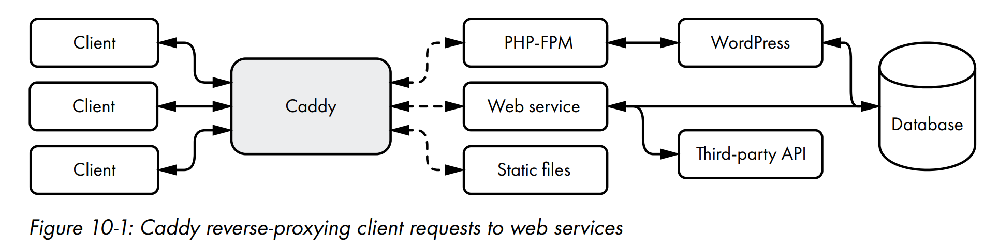

# CADDY: A CONTEMPORARY WEB SERVER

This chapter will introduce you to the Caddy web server and show you how to focus your time on writing web services while relying on Caddy to serve your application.

## What Is Caddy?

Caddy is a contemporary web server that focuses on security, performance, and ease of use. Among its hallmark features, it offers automatic TLS certificate management, allowing you to easily implement HTTPS. 

### Let’s Encrypt Integration

You can retrieve certificates for your website by using Let’s Encrypt’s automated issuance and renewal protocol, known as Automated Certificate Management Environment (ACME).

Typically, getting a certificate requires three steps: a certificate request,
domain validation, and certificate issuance.

1. First, you request a certificate for your domain from Let’s Encrypt. 
2. Let’s Encrypt then confirms your domain to make sure you administer it.
3. Once Let’s Encrypt has ensured that you’re the domain’s rightful owner, it issues you a certificate, which your web server can use for HTTPS support.

Caddy has inherent support for the ACME protocol and will automatically request, validate, and install Let’s Encrypt certificates if Caddy can properly derive the domain names it hosts.

### How Does Caddy Fit into the Equation?

Caddy works just like other popular web servers, such as NGINX and Apache. It’s best positioned on the edge of your network, between web clients and your web services.



Caddy can serve static files and forward requests between clients and backend services, a process known as reverse proxying.

If you use Caddy’s automatic TLS, static file server, data compression, access control, and logging features, you won’t have to add that functionality to each web service.

## Retrieving Caddy

You can install Caddy by using a static binary, built by the Caddy team. This `:binary is available through the download link at https://caddyserver.com/.

## Running and Configuring Caddy

For configuration purposes, Caddy exposes an administration endpoint on TCP port 2019, over which you can interact with Caddy’s configuration in real time. You can configure Caddy by posting JSON to this endpoint, and you can read the configuration with a GET request.

Before you can configure Caddy, you need to start it. Running this command starts Caddy as a background process:

```bash
caddy start
```

Caddy’s configuration is empty by default. Let’s send meaningful configuration data to Caddy.

Caddy supports configuration traversal. Configuration traversal lets you request a subset of the configuration by treating each JSON key in the configuration data as a resource address.

For example, to get the current configuration, you can send a GET request to the administration endpoint:

```bash
curl http://localhost:2019/config
```

## Modifying Caddy’s Configuration in Real Time

You can use the other HTTP verbs you learned in Chapter 8 to modify your server’s configuration. Any changes you make will take immediate effect, so long as Caddy can parse the JSON you send. If Caddy fails to parse the JSON, or if a fundamental error exists in the new configuration, Caddy will log an error with an explanation of what went wrong and continue to use its existing configuration.

## Extending Caddy with Modules and Adapters

Caddy uses a modular architecture to organize its functionality. This modular approach allows you to extend Caddy’s capabilities by writing your own modules and configuration adapters. In this section, we’ll walk through the process of writing a configuration adapter that will allow you to store your Caddy configuration in a `Tom’s Obvious, Minimal Language (TOML)` file.

We’ll also replicate the `restrict_prefix` middleware from the preceding chapter in a proper Caddy module.

### Writing a Configuration Adapter

Although JSON is a perfectly good format for configuration files, it isn’t as
well suited for human consumption as other formats. JSON lacks support for comments and multiline strings, two characteristics that make configuration files easier for people to read.

Caddy supports the use of configuration adapters that adapt one format, such as TOML, to Caddy’s native JSON format.

Caddy doesn’t ship with an official configuration adapter for TOML,
so let’s take a crack at writing one. You need to first create a Go module for your TOML configuration adapter.

### Writing a Restrict Prefix Middleware Module

Chapter 9 introduced the concept of middleware, a design pattern that allows your code to manipulate a request and a response and to perform ancillary tasks when the server receives a request, such as logging request details. Let’s explore how to use middleware with Caddy.

In Go, middleware is a function that accepts an `http.Handler` and returns an `http.Handler`:

```go
type Middleware func(http.Handler) http.Handler
```

An `http.Handler` describes an object with a `ServeHTTP` method that accepts an `http.RequestWriter` and an `http.Request`:

```go
type Handler interface {
	ServeHTTP(w http.ResponseWriter, r *http.Request)
}
```

Assuming `myHandler` is an object that implements the `http.Handler` interface, and `middleware1`, `middleware2`, and `middleware3` all accept an `http.Handler` and return an `http.Handler`, you can apply the middleware functions to `myHandler` like this:

```go
h := middleware1(middleware2(middleware3(myHandler)))
```

Unfortunately for us, Caddy’s middleware does not use this design pattern, so it cannot use RestrictPrefix. Caddy includes interfaces for both `handlers` and `middleware`, unlike net/http, which describes only `handlers`.

Caddy’s equivalent of the `http.Handler` interface is `caddyhttp.Handler`:

```go
type Handler interface {
	ServeHTTP(http.ResponseWriter, *http.Request) error
}
```

The only difference between `caddyhttp.Handler` and `http.Handler` is that the former’s `ServeHTTP` method returns an `error` interface.

Caddy middleware is a special type of handler that implements the `caddyhttp.MiddlewareHandler` interface:

```go
type MiddlewareHandler interface {
	ServeHTTP(http.ResponseWriter, *http.Request, Handler) error
}
```

The `ServeHTTP` method accepts a `http.ResponseWriter`, a `http.Request`, and a `Handler`. The `Handler` is the next handler in the chain, and the `MiddlewareHandler` is responsible for calling it.

Like `caddyhttp.Handler`, Caddy’s middleware accepts both an `http.ResponseWriter` and an `http.Request`, and it returns an `error` interface. But it accepts an additional argument: the `caddyhttp.Handler`, downstream from the middleware in the same way that `myHandler` is downstream from `middleware3`.

Instead of accepting an `http.Handler` and returning an `http.Handler`, Caddy expects its middleware to act as handlers, with access to the `caddyhttp.Handler` that should receive the request and response after the middleware is done with them.

check the `restrict_prefix.go` file for the complete implementation of the RestrictPrefix middleware.

### Injecting Your Module into Caddy

The module and adapter you wrote are both self-registering. All you need to do to include their functionality in Caddy is to import them at build time.
To do that, you need to compile Caddy from source. Start by making a directory for your build:

``` bash
$ mkdir caddy
$ cd caddy
```

Building Caddy from source code requires a small amount of boilerplate code, to which you’ll include your modules. Your modules register themselves with Caddy as a side effect of the import. Create a new file named main.go and add the code:

```go
package main
import (
	cmd "github.com/caddyserver/caddy/v2/cmd"
	_ "github.com/caddyserver/caddy/v2/modules/standard"
	// Injecting custom modules into Caddy
	_ "github.com/awoodbeck/caddy-restrict-prefix"
	_ "github.com/awoodbeck/caddy-toml-adapter"
)
func main() {
cmd.Main()
}

```

Build it:

```bash
$ go mod init caddy
$ go build
```

At this point, you should have a binary named caddy in the current directory. You can verify that it has your custom imports by looking for them in the caddy binary’s list of modules.

```
./caddy list-modules | grep "toml\|restrict_prefix"
```

## Reverse-Proxying Requests to a Backend Web Service

Let’s put everything you’ve learned together by configuring Caddy to reverse-proxy requests to a backend web service and serve up static files on behalf of the backend web service. You’ll create two endpoints in Caddy. The first endpoint will serve up only static content from Caddy’s file server, showing Caddy’s static file-serving abilities. The second endpoint will reverse-proxy requests to a backend web service. 

### Creating a Simple Backend Web Service

This service will respond to all requests with an HTML document that includes the static files Caddy serves on the service’s behalf.

Check the `backend.go` file for the complete implementation of the backend web service.

### Setting Up Caddy’s Configuration

You want to configure Caddy to reverse-proxy requests to your backend web service and serve static files from the files subdirectory. You’ll need two routes: one to the backend web service and one for static files.
Let’s start by defining your server configuration in a file named caddy.toml.

Caddy includes a powerful reverse-proxy handler that makes quick work of sending incoming requests to your backend web service. Just as in the server implementation in the preceding chapter, Caddy matches an incoming request to a route and then passes the request onto the associated handler.

### Serving Static Files

You relied on the http.FileServer to serve static files for you in the preceding
chapter. Caddy exposes similar functionality with its file_server handler.