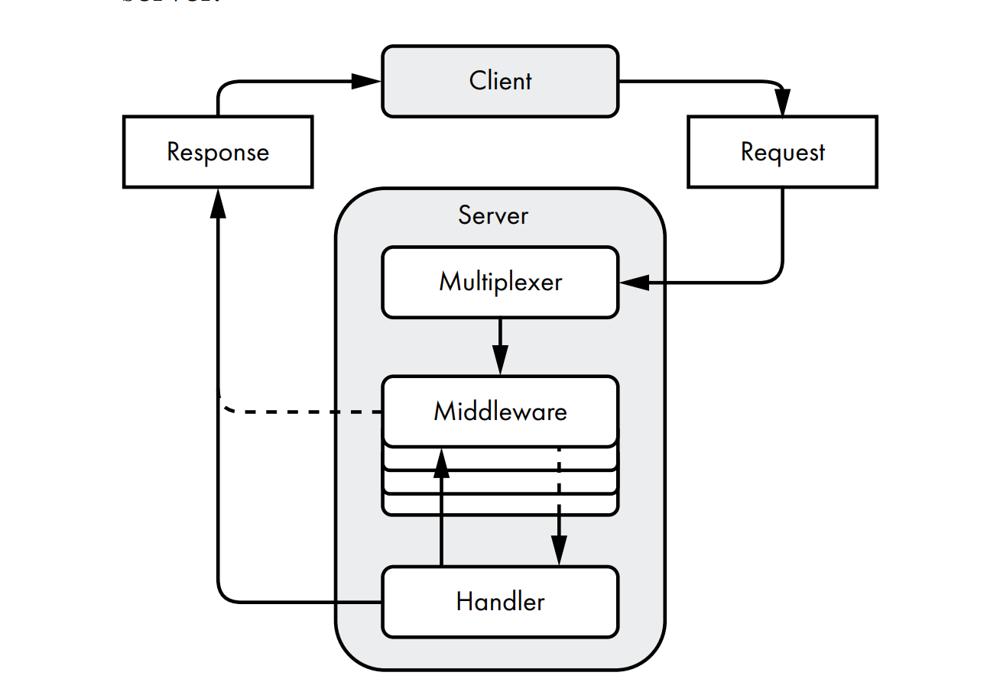

# BUILDING HTTP SERVICES

In Go, an HTTP server relies on several interacting components: handlers, middleware, and a multiplexer. When it includes all these parts, we call this server a web service.

## The Anatomy of a Go HTTP Server

Check the following picture for the request flow.



First, the server’s `multiplexer` (router, in computer-networking parlance) receives the client’s request. The `multiplexer` determines the destination for the request, then passes it along to the object capable of handling it. We call this object a handler. (The `multiplexer` itself is a handler that routes requests to the most appropriate handler.)

Before the `handler` receives the request, the request may pass through one or more functions called `middleware`. `Middleware` changes the handlers’ behavior or performs auxiliary tasks, such as logging, authentication, or access control.

check `TestSimpleHTTPServer` for more details.

`http.TimeoutHandler` is a middleware that returns a `503 Service Unavailable` error if the request takes too long.

`IdleTimeout` is the maximum amount of time the server will wait for a new request when the connection is idle.

`ReadHeaderTimeout` is the maximum amount of time the server will wait for the request headers.

### Clients Don’t Respect Your Time

Manage the various server time-out values, for the simple reason that clients won’t otherwise respect your server’s time. A client can take its sweet time sending a request to your server. Meanwhile, your server uses resources waiting to receive the request in its entirety. Likewise, your server is at the client’s mercy when it sends the response because it can send data only as fast as the client reads it (or can send only as much as there is TCP buffer space available). Avoid letting the client dictate the duration of a request-response life cycle.

`IdleTimeout` : the length of time clients can remain idle between requests. The `IdleTimeout` field dictates how long the server will keep its side of the TCP socket open while waiting for the next client request when the communication uses keepalives.

`ReadHeaderTimeout` : how long the server should wait to read a request header. It determines how long the server will wait to finish reading the request headers. Keep in mind that this duration has no bearing on the time it takes to read the request body.

If you want to enforce a time limit for reading an incoming request across all handlers, you could manage the request deadline by using the `ReadTimeout` field. If the client hasn’t sent the complete request (the headers and body) by the time the `ReadTimeout` duration elapses, the server ends the TCP connection.

Likewise, you could give the client a finite duration in which to send the request and read the response by using the `WriteTimeout` field.

The `ReadTimeout` and `WriteTimeout` values apply to all requests and responses because they dictate the `ReadDeadline` and `WriteDeadline` values of the TCP socket.

These blanket time-out values may be inappropriate for handlers that expect clients to send large files in a request body or handlers that indefinitely stream data to the client.

In these two examples, the request or response may abruptly time out even if everything went ahead as expected. Instead, a good practice is to rely on the `ReadHeaderTimeout` value.

### Adding TLS Support

HTTP traffic is plaintext by default, but web clients and servers can use HTTP over an encrypted TLS connection, a combination known as HTTPS.

Go’s HTTP server enables `HTTP/2` support over TLS connections only, but enabling TLS is a simple matter.

```go
srv := &http.Server{
	// the convention is to serve HTTPS over port 443, or an augmentation of port 443,
	// like 8443.
	Addr:         "127.0.0.1:8443",
	Handler:      mux,
	IdleTimeout:  5 * time.Minute,
	ReadTimeout:  time.Minute,
	WriteTimeout: time.Minute,
}

l, err := net.Listen("tcp", srv.Addr)
if err != nil {
	t.Fatal(err)
}

go func() {
	// Using the server’s ServeTLS method, you instruct the server to use
	// TLS over HTTP. The ServeTLS method requires the path to both a
	// certificate and a corresponding private key.

    // https://github.com/FiloSottile/mkcert/
	err := srv.ServeTLS(l, "example.com+5.pem", "example.com+5-key.pem")
	if err != http.ErrServerClosed {
		t.Error(err)
	}
}()
```

## Handlers

When a client sends a request to an HTTP server, the server needs to figure out what to do with it. The server may need to retrieve various resources or perform an action, depending on what the client requests. A common design pattern is to specify bits of code to handle these requests, known as handlers.

In Go, handlers are objects that implement the `http.Handler` interface. They read client requests and write responses. The `http.Handler` interface consists of a single method to receive both the response and the request:

```go
type Handler interface {
	ServeHTTP(http.ResponseWriter, *http.Request)
}
```

We often define handlers as functions, as in this common pattern:

Here, you wrap a function that accepts an `http.ResponseWriter` and an `http.Request` pointer in the `http.HandlerFunc` type, which implements the `Handler` interface.

```go
handler := http.HandlerFunc(
    func(w http.ResponseWriter, r *http.Request) {
    _, _ = w.Write([]byte("Hello, world!"))
    },
)
```

Go programmers commonly convert a function with the signature `func(w http.ResponseWriter, r *http.Request)` to the `http.HandlerFunc` type so the function implements the `http.Handler` interface.

**NOTE** it’s important for the server to do the same with the request body. But unlike the Go HTTP client, closing the request body does not implicitly drain it. Granted, the `http.Server` will close the request body for you, but it won’t drain it. To make sure you can reuse the `TCP session`, I recommend you `drain the request body` at a minimum. `Closing` it is optional.

### Test Your Handlers with httptest

`net/http/httptest`. This package makes unit-testing handlers painless.

The `net/http/httptest` package exports a NewRequest function that accepts an HTTP method, a target resource, and a request body io.Reader. It returns a pointer to an http.Request ready for use in an http.Handler:

```
func NewRequest(method, target string, body io.Reader) *http.Request
```

Unlike its `http.NewRequest` equivalent, `httptest.NewRequest` will panic instead of returning an error. This is preferable in tests but not in production code.


The `httptest.NewRecorder` function returns a pointer to an `httptest.ResponseRecorder`, which implements the `http.ResponseWriter` interface.

Although the `httptest.ResponseRecorder` exports fields that look tempting to use (I don’t want to tempt you by mentioning them), I recommend you call its `Result` method instead. The `Result` method returns a pointer to an `http.Response` object, just like the one we used in the last chapter. As the method’s name implies, it waits until the handler returns before retrieving the `httptest.ResponseRecorder`‘s results.

If you’re interested in performing integration tests, the `net/http/httptest` package includes a test server implementation.

```go
func TestDefaultHandler(t *testing.T) {
	rec := httptest.NewRecorder()
	req := httptest.NewRequest(http.MethodGet, "/", nil)
	DefaultHandler().ServeHTTP(rec, req)

	resp := rec.Result()
	body, _ := io.ReadAll(resp.Body)
	_ = resp.Body.Close()
}
```

### How You Write the Response Matters

Here’s one potential pitfall: the order in which you write to the response body and set the response status code matters. The client receives the response status code first, followed by the response body from the server.

If you write the response body first, Go infers that the response status code is 200 OK and sends it along to the client before sending the response body.

check `TestHandlerWriteHeader` for more details.

Remember, the server sends the response status code before the response body. Once the response’s status code is set with an explicit or implicit call to `WriteHeader`, you cannot change it because it’s likely on its way to the client.

This function sets the content type to text/plain, sets the status code to `400 Bad Request`, and writes the error message to the response body.

```go
func badRequestHandler(w http.ResponseWriter, r *http.Request) {
  http.Error(w, "Bad request", http.StatusBadRequest)
}
```

### Any Type Can Be a Handler

Because http.Handler is an interface, you can use it to write powerful constructs for handling client requests.

Let’s improve upon the `default handler`. check `DefaultMethodsHandler` for more details.

